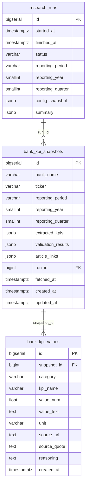

# ERD — Cơ sở dữ liệu

## Sơ đồ quan hệ (Mermaid)

## Giải thích nhanh

| Bảng | Mục đích |
|------|----------|
| **research_runs** | Mỗi lần chạy daily crawl (audit). `reporting_year` / `reporting_quarter` parse từ `reporting_period` (e.g. Q1 2025). |
| **bank_kpi_snapshots** | Một bản ghi = KPI một ngân hàng cho một kỳ. Upsert theo `(bank_name, reporting_period)`. Vẫn lưu `extracted_kpis` JSONB. |
| **bank_kpi_values** | Từng chỉ tiêu KPI tách riêng (category, kpi_name, value_num/value_text, unit, source...). Dùng để query/filter theo chỉ tiêu. |

Migration: `001_initial_schema.sql` (research_runs, bank_kpi_snapshots), `002_reporting_period_and_kpi_values.sql` (cột year/quarter, bảng bank_kpi_values).
