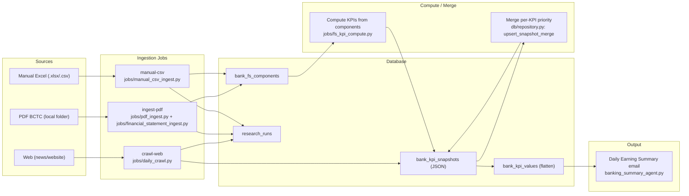

# Agent-Competitor: Project Overview

Tài liệu này giải thích luồng dữ liệu và cách các module trong dự án phối hợp để:

- thu thập KPI ngân hàng (Web / PDF BCTC / Manual Excel),
- chuẩn hóa và lưu vào database theo rule ưu tiên,
- tạo email "Daily Earning Summary" (Outlook-friendly) hoàn toàn từ database.

Nếu bạn cần hướng dẫn lệnh chạy chi tiết theo từng luồng, xem thêm: `docs/PIPELINE_GUIDE.md`.

## 1) Mục Tiêu Sản Phẩm

- Theo dõi 7 ngân hàng mục tiêu: `TCB, VCB, CTG, BID, MBB, VPB, ACB`.
- Duy trì snapshot KPI theo ngày chạy (target_date) cho từng kỳ báo cáo (reporting_period, ví dụ `Q1 2026`).
- Nguồn dữ liệu có độ ưu tiên: `web < financial_statement_pdf < manual_override`.
- Email summary chỉ dựa trên dữ liệu đã lưu trong DB (không bịa số, không đọc file .md/.pdf khi gửi mail).

## 2) Kiến Trúc Dữ Liệu (DB)

Các bảng chính:

- `research_runs`
  - Audit mỗi lần chạy job (web/pdf/excel/merge), status + summary.
- `bank_kpi_snapshots`
  - Snapshot theo `bank_name + reporting_period + target_date`.
  - Có cột `extracted_kpis` dạng JSON (full payload).
- `bank_kpi_values`
  - Bảng phẳng (flatten) từng KPI: dễ query, dùng cho email/report.
- `bank_fs_components`
  - Raw components/cấu phần trích từ BCTC (hoặc manual) để:
    - compute KPI (CASA, growth, total_credit, NIM LTM...),
    - audit reasoning/công thức,
    - cho phép ghi đè theo priority.

Khái niệm:

- **KPI final**: những KPI hiển thị trong snapshot/email (ví dụ `pbt`, `total_credit`, `deposit_growth_ytd`, `toi_growth`...).
- **FS component**: cấu phần thô trích từ BCTC (ví dụ `credit_customer_loans`, `casa_ratio_a`, `opex`...).

## 3) Luồng Tổng Quan (End-to-End)

## 4) Quy Tắc Ưu Tiên Dữ Liệu (Per-KPI)

Áp dụng theo từng KPI riêng lẻ (không overwrite toàn snapshot):

1. `manual_override` (cao nhất)
2. `financial_statement_pdf`
3. `web` / `other` (thấp nhất)

Triển khai tại:

- `db/repository.py` trong `upsert_snapshot_merge()` (merge theo `source_type` của từng KPI).
- `db/repository.py` trong `upsert_fs_components()` (merge theo `source_type` cho từng component).

Hệ quả:

- Rerun web không làm mất KPI từ PDF/manual.
- Rerun PDF có thể ghi đè web nhưng không ghi đè manual.
- Rerun manual sẽ ghi đè tất cả.

## 5) Ba Luồng Ingestion (Tách Lệnh Chạy)

### 5.1) Web crawl (ưu tiên thấp nhất)

- Entry: `python main.py crawl-web ...`
- Module: `jobs/daily_crawl.py`
- Output: upsert snapshot theo ngày (merge per KPI) + `bank_kpi_values`.

### 5.2) PDF BCTC (ưu tiên cao hơn web)

- Entry: `python main.py ingest-pdf ...`
- Module:
  - `jobs/pdf_ingest.py` (job wrapper)
  - `jobs/financial_statement_ingest.py` (PDF discovery + extraction + build components)
  - `jobs/fs_kpi_compute.py` (compute KPI final từ components)
- Output:
  - upsert raw `bank_fs_components`
  - compute KPI final và upsert snapshot (merge per KPI)

Ghi chú cache:

- `jobs/financial_statement_ingest.py` có manifest cache tại `outputs/bctc_ingestion_manifest.json`
  - tránh extract lại nếu PDF/requests_version không đổi.
  - khi đổi prompt/keywords, cần bump `KPI_REQUESTS_VERSION`.

### 5.3) Manual Excel (ưu tiên cao nhất)

- Entry: `python main.py manual-csv --csv ...`
- Module: `jobs/manual_csv_ingest.py`
- Output:
  - upsert `bank_fs_components` với `source_type=manual_override`
  - compute KPI final (nếu cần) và merge vào snapshot

## 6) Lệnh "merge" (Chạy Theo Thứ Tự Ưu Tiên)

- Entry: `python main.py merge --period ... --date ... [--excel path]`
- Thực chất chạy tuần tự:
  1. web
  2. pdf
  3. excel (nếu có)

Rule ưu tiên đảm bảo kết quả cuối cùng đúng theo: `web < pdf < excel`.

## 7) Tính Toán KPI Từ Components

Logic tính KPI final (khi dữ liệu nguồn là BCTC/manual) nằm tại:

- `jobs/fs_kpi_compute.py`

Ví dụ:

- `total_credit`: ưu tiên `total_credit_reported`, fallback sum các cấu phần credit.
- `credit_growth_ytd`: compute từ `total_credit` current/previous.
- `deposit_growth_ytd`: compute từ `total_deposits` current/previous.
- `casa_ratio`: compute từ `casa_ratio_a/b/c/d`.
- `casa_growth_ytd`: compute từ CASA balance `a+b+c` (current/previous).
- `nim (LTM)`: cần lịch sử nhiều quý trong `bank_fs_components`.

## 8) Daily Earning Summary Email

- Entry: `python banking_summary_agent.py --period "Q1 2026"`
- Email đọc dữ liệu từ DB (snapshot/values), không đọc PDF/MD lúc gửi mail.

Điểm chính:

- Earning Summary (executive): chỉ show bank có update so với snapshot trước.
- Earning Snapshot table: hiển thị KPI, link reference đánh index, format tối ưu Outlook.
- Nguồn BCTC/manual được coi là mặc định (text thường); nguồn web thể hiện italic + dấu `*`.

## 9) Debug Nhanh (Khi “Có PDF nhưng không lên DB”)

1. Check log `[PDF] ... skipped: reason=...` trong `ingest-pdf`
   - `no_pdf_found`: không match filename trong `BCTC_PDF_DIR`.
   - `manifest_cache_empty`: cache rỗng từ lần trước.
   - `extracted_empty`: PDF có nhưng extractor không lấy được item.
   - `exception`: lỗi runtime trong pipeline.
2. Verify data ở `bank_fs_components` (component_key có xuất hiện chưa).
3. Verify snapshot theo `target_date` đúng ngày bạn chạy.
4. Nếu đổi prompt/keywords, bump `KPI_REQUESTS_VERSION` để tránh cache giữ kết quả cũ.

